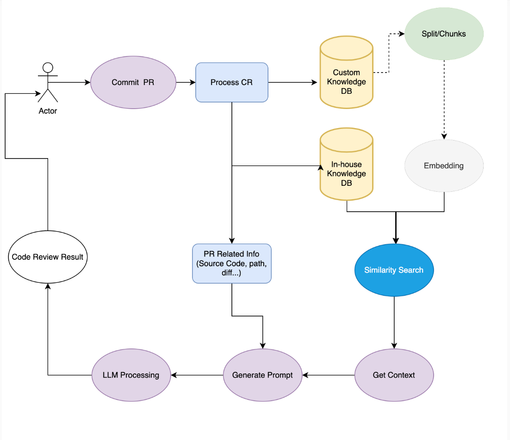

[](https://github.com/0xhzx/codeReview-gitlab/actions/workflows/cicd.yml)

# Final Project - LLM-CodeReview-Gitlab

Link to my final demo video: https://youtu.be/8hwNKeqkpPY

## Requirements:

1. Has to be very well documented with a README.md that explains what the main purpose of the application is, how to set it up, and run it.
2. The documentation needs to have workable examples of the application.
3. It needs to have tests
4. The project should have automation with GitHub Actions that can produce a working container image. The resulting image should not include the LLM.

## Rubric:

#### Repository & Documentation
- Project purpose

    The purpose of the LLM-Codereview application is to streamline and automate the process of code review in software development projects. It aims to improve the efficiency and effectiveness of code reviews by providing automated suggestions and feedback based on best coding practices.


- Architecture diagram
This app is built with Flask and llamafile, utilizing gitlab webhook, to implement automatic code-review by LLM and directly comment on the target PR. After my testing, the LLM would perform better without RAG from content and speed aspects(maybe because of the unsatisfying RAG dataset) The llamafile will be downloaded by executing `setup.sh` shell script. The LLM service and APP service are running on different port, we can just create the Docker image with the APP code(no llamafile).



- Setup steps:
If you want to use cloud platform to run the application such as GCP, you can follow this screenshot to create a Machine Instance and then SSH to it.


    1. create a venv: `python3 -m ven venv`
    2. activate venv: `source venv/bin/activate`
    3. install all the dependency: `pip install -r requirements.txt`
    4. prepare the LLM from llamafile: `bash setup.sh`
    5. run the LLM in the background: `bash app.sh`
    6. run tests before deployment: `make test`
    7. run the code-review app: `python3 app.py`


- Performance/evaluation results

    - Content: I think the evaluation result based on content is good enough. The LLM can give a insightful advice and help revise the code.

    - Speed: As the following screenshot shows, from the LLM backend received the request from the gitlab to LLM generated all the review and commented on the PR, it took about **87s** to generate **891** tokens for test_mysql.py and **55s** to generate **621** tokens.

        In this situation, it is hard to do some load tesing becasue each request should be triggered by gitlab MR which means that I have to create different repos and send MRs at the same time. Therefore, no load testing here. Also, in the beginning, I plan to use FastAPI as the backend framework, but considering that we can not send and handle asynchronous requests, I still choose the Flask to build up this demo.

        

- Unit tests for all core functionality

    They are all placed under /tests folder. Avg coverage reachs to `72%`。


#### CI/CD Pipeline
- Use Github Actions or similar to trigger an automated CI/CD workflow on push/PR or manual trigger

I use github actions for CI/CD workflow on each push/PR with main branch
```yml
name: CI
on:
  push:
    branches: [ "main" ]
  pull_request:
    branches: [ "main" ]
  workflow_dispatch:

jobs:
  build:
    runs-on: ubuntu-latest
    steps:
      - uses: actions/checkout@v3
      - name: install packages
        run: make install
      - name: lint
        run: make lint
      - name: format
        run: make format
      - name: test
        run: make test
      - name: Login to Docker Hub
        run: docker login -u ${{ secrets.DOCKER_HUB_USERNAME }} -p ${{ secrets.DOCKER_HUB_PASSWORD }}
      - name: Build and push Docker image
        run: make docker-build docker-push
```

- CI/CD pipeline should include all the stages:
```Makefile
install:
	pip install --upgrade pip &&\
		pip install -r requirements.txt

test:
	python3 -m pytest -vv --cov=service tests/test_*.py

format:	
	black *.py service/*.py app/*.py

lint:
	#disable comment to test speed
	#pylint --disable=R,C --ignore-patterns=test_.*?py *.py mylib/*.py
	#ruff linting is 10-100X faster than pylint
	ruff check --ignore F403,F405,F841 *.py service/*.py

container-lint:
	docker run --rm -i hadolint/hadolint < Dockerfile

# Building the Docker image
docker-build:
    docker build -t 0xhzx/llmops:latest .

# Pushing the image to a container registry (e.g., Docker Hub)
docker-push:
    docker push 0xhzx/llmops:latest


refactor: format lint

deploy:
	#deploy goes here
		
all: install lint test format

```


#### Functionality & Performance
- Uses local .llamafile model outside the Docker container and model selection

    I choose `Mozilla/Mistral-7B-Instruct-v0.2-llamafile` here as the LLM because it has an active community on huggingface and its size(3.86G) is affordable for deploying on 16 cores CPU machine. After you run the command `bash setup.sh`, the LLM files will be downloaded in the current /models folder. Note: the llamafile is seperated from the APP's Dockerfile/Container. It should be downloaded by running shell script `setup.sh`.


- Chatbot runs successfully as a local containerized service

    Follow these steps and you will run the app in a local containerized service successfully.
    ```bash
    docker login
    # build docker image
    docker build -t llmops:latest .
    # tag
    docker tag llmops:latest 0xhzx/llmops:latest
    # push to dockerhub
    docker push 0xhzx/llmops:latest
    # run the container
    docker run -d -p 7477:7477 llmops
    ```
    

#### Bonus Points 
- Demonstrate that you've taken a risk to learn something new, incorporated a cool new framework/technology, or gone above and beyond the minimum requirements

    I ventured into new territory, LLM CR tool, by experimenting with GitLab webhooks, a technology that was completely new to me. I explored the best practice to build up such an efficient tool for developers to save their CR time and received better review suggestions. This tool is different from traditional LLM Chatbot but I believe that this will be pretty useful in the future.